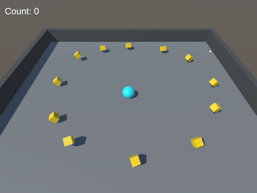

# Roll-a-Ball Tutorial

This project is a result of following the "Roll-a-Ball" tutorial from Unity. The goal of the game is to roll a ball around a plane and collect all the collectibles scattered across the play area.

## Demo

